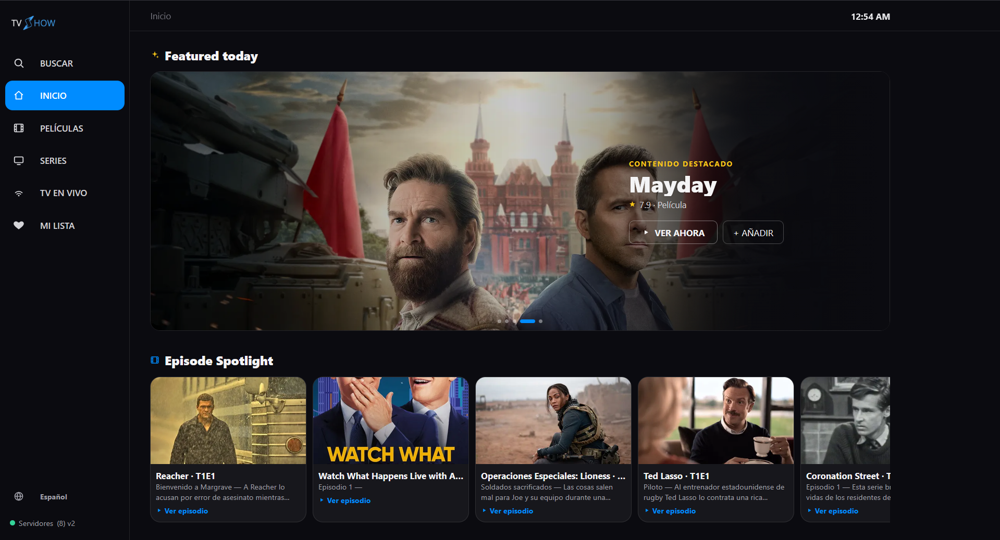

# TVShow — Catálogo + Player multi-servidor

App Next.js 14 + TypeScript + Tailwind. Indexa películas/series (TMDB o modo free
Cinemeta + TVMaze con IDs IMDb) y las reproduce vía iframes de proveedores configurables.

No aloja video: solo indexa IDs/posters/metadata y embebe reproductores de terceros.



## Requisitos

- Node 18+

## Puesta en marcha

```bash
npm install
cp .env.example .env.local   # y rellena tus keys
npm run dev                  # http://localhost:3000
```

## Variables (.env.local)

| Var | Obligatoria | Descripción |
| --- | --- | --- |
| `TMDB_API_KEY` | No | Key gratuita de themoviedb.org. Sin ella, modo free (Cinemeta + TVMaze). |
| `PROVIDERS_URL` | No | URL de tu JSON de servidores. Vacío = `/providers.json` local. |
| `PROVIDERS_SOURCE=local` | No | Test: fuerza el JSON local ignorando el remoto. |
| `VIMEUS_VIEW_KEY` | Solo si usas Vimeus | View key de tu panel (se inyecta en servidor, nunca sale al cliente). |
| `EASTER_EGG` | No | Secreto del Easter Egg del footer (validado en servidor). |

## Servidores: cada uno gestiona los suyos (sin recompilar)

La lista de servidores **no está en el código**: vive en un JSON externo que cada
despliegue configura con `PROVIDERS_URL` (variable **privada**, sin `NEXT_PUBLIC_`).
Las URLs finales se arman en `/api/embed-url`, así que las keys nunca llegan al navegador.

1. Copia `public/providers.json` a tu propio host (un gist de GitHub, cualquier
   archivo estático con CORS abierto).
2. En tus env pon `PROVIDERS_URL=https://tu-url/providers.json`.
3. Reinicia/despliega. El detector del header pasa a 🟢 con tu conteo.

Si la variable se deja vacía, la app usa el `/providers.json` local incluido.

### Probar sin romper nada

`PROVIDERS_SOURCE=local` fuerza el JSON local del repo
(`public/providers.json`) ignorando el remoto. Edita, prueba en dev y cuando
funcione súbelo a tu URL remota. Requiere reiniciar el dev.
Si tu URL falla, se usa la lista integrada de `lib/providers.ts` como respaldo.

### Esquema del JSON

Bloque `providers` (reproductores de pelis/series) y `live` (fuentes de TV en vivo):

```json
{
  "version": "1",
  "providers": [
    { "id": "vidzy", "name": "Vidzy", "needsTmdb": true,
      "movie": "https://vidzy.org/movie/{id}?autoplay=1",
      "tv": "https://vidzy.org/serie/{id}/{s}/{e}?autoplay=1&autonext=1" }
  ],
  "live": [
    { "id": "tvf90", "name": "Agenda deportiva", "format": "tvf90",
      "list": "https://tvf90.com/status.json" }
  ]
}
```

- Placeholders reproductores: `{id} {s} {e} {key} {idparam} {tmdbflag}`
  (`{idparam}` = `imdb=tt…` o `tmdb=…`; `{tmdbflag}` = `""` o `"&tmdb=1"`).
- `needsTmdb: true` convierte IMDb→TMDB solo vía Cinemeta.
- `sandbox` (opcional, desaconsejado): la mayoría de players lo bloquean.
  En su lugar la app usa puerta click-to-play (absorbe el primer clic que suele
  disparar popups) + confirmación anti-secuestro si un iframe intenta redirigir
  la página. Para bloqueo total recomienda Brave o uBlock Origin.
- Formatos live soportados: `streambetter` y `tvf90`.
- **`version` (recomendado)**: súbelo en cada cambio (1, 2, 3…). La web lo muestra
  en el header (`(8) v3`) y en el reproductor (`lista v3`): así verificas de un
  vistazo que cargó la versión correcta y no una caché vieja.

## Desplegar en Vercel

1. Importa el repo. Node 22+ (ya fijado en `engines`).
2. En **Settings → Environment Variables** añade:
   - `TMDB_API_KEY` (opcional, modo free sin ella)
   - `PROVIDERS_URL` (legacy; sin uso si hay Supabase)
   - `VIMEUS_VIEW_KEY` (solo si usas Vimeus)
   - `EASTER_EGG` (privada)
   - `SUPABASE_URL` + `SUPABASE_SERVICE_KEY` (acceso por código; service_role solo servidor)
   - `ADMIN_PASSWORD` (panel /admin)
3. Deploy y verifica en `https://tu-app.vercel.app/api/config`:
   debe mostrar `tmdb/vimeusKey/easterEgg: true` (sin revelar valores).

## Scripts

- `npm run dev` — desarrollo
- `npm run build` / `npm start` — producción
- `npm version patch|minor|major` — sube la versión manualmente
  (se muestra en el footer como `vX.Y.Z`)

> **Versionado automático**: cada `git commit` sube el patch solo
> (hook `pre-commit` → `scripts/bump-version.mjs`). Para saltarlo:
> `SKIP_VERSION=1 git commit ...`. Para minor/major usa `npm version`.
- `npm run sync -- movie:550 tv:1399 --lang es,en,pt` — vuelca TMDB a SQLite

## App Android (Capacitor + antibloqueo, F-Droid)

Shell nativo sobre producción con bloqueo de popups/trackers a nivel WebView
(`android/.../AdBlock*.java` + `assets/adhosts.txt`).

```bash
npx cap sync android
# abrir android/ en Android Studio → Run (o Build > APK)
```

Notas: `android/` e `ios/` no se commitean (se generan). `fastlane/metadata`
para F-Droid. La lista de hosts está en `android/app/src/main/assets/adhosts.txt`.

## Caché SQLite (`data/tmdb.db`, sin imágenes)

Con key TMDB, el detalle de pelis/series/personas se guarda en SQLite local
(detalle, géneros, créditos, temporadas, episodios, IMDb id) con caducidad de
7 días: las visitas no pegan a la API si hay dato fresco. Precarga con:

```bash
# en .env.local: TMDB_API_KEY=tu_key
npm run sync -- movie:550 tv:1399 person:3223 --lang es,en,pt
npm run sync -- --popular movie 10 --lang es
npm run sync -- --trending tv --lang es
```

El `.db` está en `.gitignore`. En Vercel el FS es efímero: funciona como
caché por instancia (se rellena solo al visitar).

## Notas

- Navegable con mando de TV (flechas + OK + Atrás) y foco visible.
- Seguir viendo, Mi lista y servidor elegido viven en `localStorage` (por navegador).
