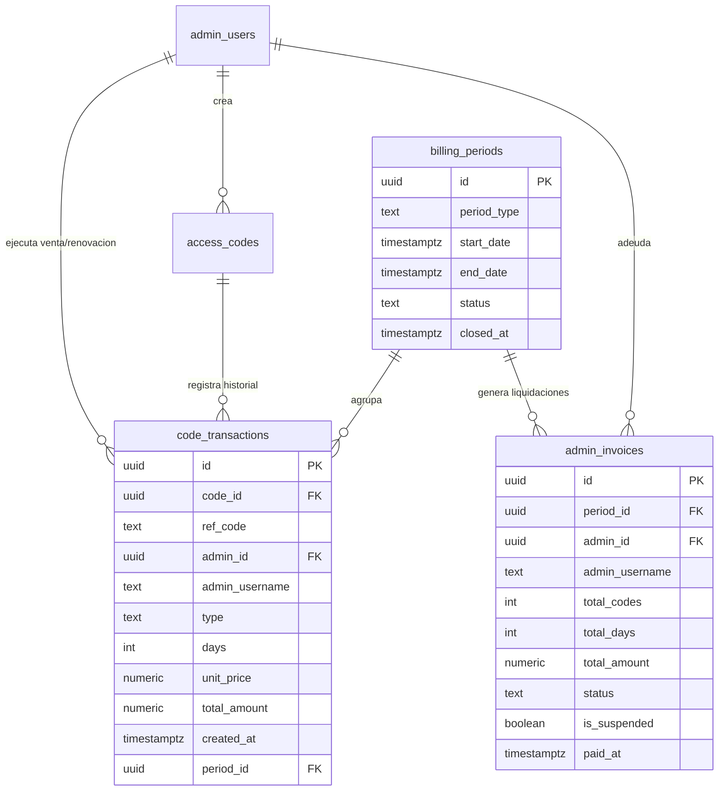

# Plan 025: Control de Ventas, Cierres de Facturación y Suspensión por Morosidad

## Enfoque
Implementar un sistema financiero integral para TVShow que relacione a los administradores (`admin_users`) con los códigos generados y renovados (`access_codes`), mediante un libro de transacciones (`code_transactions`), una configuración flexible de tarifas y cortes periódicos (`billing_settings`, `billing_periods`), y un mecanismo seguro de suspensión masiva y reactivación de códigos ante morosidad.

## Arquitectura de Datos (Supabase)

## Archivos a Modificar / Crear

| Archivo | Cambio |
| --- | --- |
| [`supabase/migration_billing.sql`](file:///C:/Users/Administrator/.gemini/antigravity/scratch/tvshowapp/supabase/migration_billing.sql) | **[NUEVO]** Script SQL con tablas `code_transactions`, `billing_periods`, `admin_invoices`, índices y columnas en `access_codes`. |
| [`lib/billing.ts`](file:///C:/Users/Administrator/.gemini/antigravity/scratch/tvshowapp/lib/billing.ts) | **[NUEVO]** Módulo central de lógica financiera: lectura de precios, cálculo de deuda, registro de transacciones, cierre de períodos y suspensión/reactivación en lote. |
| [`app/api/admin/billing/route.ts`](file:///C:/Users/Administrator/.gemini/antigravity/scratch/tvshowapp/app/api/admin/billing/route.ts) | **[NUEVO]** Endpoint API para consultar balances, liquidaciones, cambiar ajustes de precio/cierre y ejecutar suspensión/reactivación. |
| [`app/api/admin/codes/route.ts`](file:///C:/Users/Administrator/.gemini/antigravity/scratch/tvshowapp/app/api/admin/codes/route.ts) | **[MODIFICAR]** Enlazar la creación (`POST`) y renovación/extensión (`PATCH`) para registrar automáticamente cada evento en `code_transactions`. |
| [`app/admin/page.tsx`](file:///C:/Users/Administrator/.gemini/antigravity/scratch/tvshowapp/app/admin/page.tsx) | **[MODIFICAR]** Nueva pestaña **"Finanzas"** en la barra superior. Vista para Superadmin (ajustes, reporte general, acciones de cobro y corte) y vista para Sub-admin (su saldo, próximo corte, detalle de ventas). |
| [`lib/dict.ts`](file:///C:/Users/Administrator/.gemini/antigravity/scratch/tvshowapp/lib/dict.ts) | **[MODIFICAR]** Textos trilingües (ES, EN, PT) para términos financieros y de facturación. |

## Decisiones Técnicas
- **Precio por día como unidad fundamental:** Un código de 30 días cuesta `30 * precio_dia`. Una extensión de 15 días cuesta `15 * precio_dia`. Esto permite total flexibilidad sin importar qué duración elija el administrador.
- **Registro transaccional inmutable (`code_transactions`):** No se calcula la deuda simplemente multiplicando la fecha de expiración, sino guardando el evento real en el momento de la venta. Si el precio por día cambia a futuro, las ventas pasadas conservan su valor original inmutable.
- **Columna `suspended_by_billing` en `access_codes`:** Permite diferenciar entre un código que un admin revocó intencionalmente a un cliente específico, versus un código suspendido temporalmente por falta de pago del período. Al reactivar el período, solo se reactivan los afectados por morosidad.
- **Expulsión inmediata de sesiones activas:** Cuando se suspende un período, se llama a `resetSessionsForCode` para cada código afectado, forzando el corte en tiempo real en los Smart TVs y móviles del usuario final.

## Riesgos y Mitigaciones
- *Riesgo:* Tablas de facturación no ejecutadas de inmediato en Supabase por el usuario.  
  *Mitigación:* Implementar fallback defensivo en `lib/billing.ts`: si la tabla no existe aún, calcular estimación desde `access_codes` con valores por defecto e informar al superadmin que aplique el script de migración SQL sin romper la app.
- *Riesgo:* Desactivación masiva accidental de códigos.  
  *Mitigación:* Modal de confirmación explícito en UI indicando el número exacto de clientes que perderán acceso antes de proceder.

## Verificación
- `npm run test:sources`
- `npm run build`
- Pruebas API: creación de código registra transacción en `code_transactions`, cálculo de balance refleja la suma exacta, ejecución de suspensión revoca el código y reactivación lo restaura.
