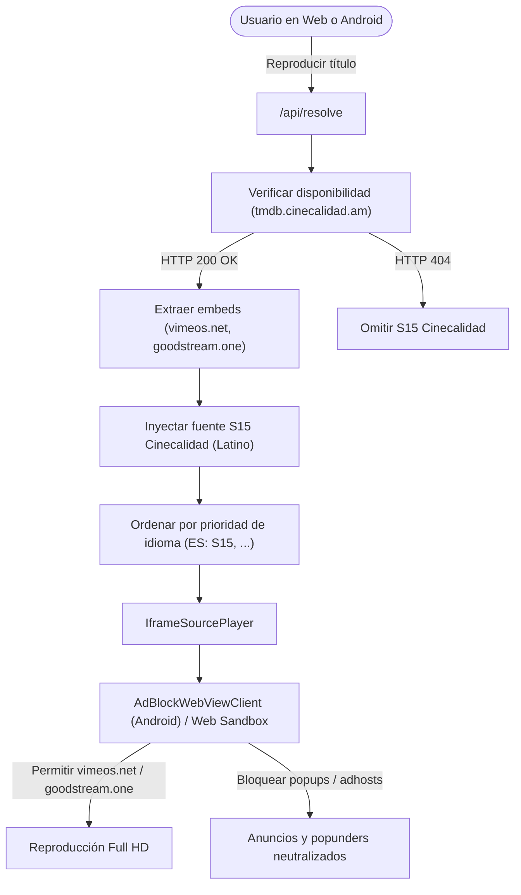

# Plan 061: Plan de Implementación del Proveedor Cinecalidad (Iframe + AdBlock)

## Arquitectura y Flujo de Trabajo

## Fases de Implementación

### Fase 1: Creación del Endpoint `/api/cinecalidad`
1. Crear `app/api/cinecalidad/route.ts` que reciba `type`, `id`, `s`, `e` y `embedIndex`.
2. Consultar `https://tmdb.cinecalidad.am/v1/playback/${kind}/${id}` (con query params en series).
3. Devolver redirección 307 al embed correspondiente o retornar 404 si no hay contenido disponible.

### Fase 2: Integración en `/api/resolve` y Adaptador de Proveedores
1. Permitir que `app/api/resolve/route.ts` resuelva directamente los embeds de Cinecalidad cuando `provider.id === 'cinecalidad'` o cuando se use la plantilla de Cinecalidad.
2. Formatear la fuente con metadata de audio Latino y calidad Full HD.

### Fase 3: Registro en Base de Datos y Semilla
1. Añadir el proveedor `cinecalidad` a `supabase/seed.sql` con `ord: 15` (`S15`).
2. Actualizar las prioridades por defecto para `es` incluyendo `S15`.

### Fase 4: Configuración de AdBlock y Whitelist en Android y Capacitor
1. Añadir `vimeos.net`, `goodstream.one`, `cinecalidad.am` a `allow` en `AdBlockWebViewClient.java`.
2. Añadir `vimeos.net`, `*.vimeos.net`, `goodstream.one`, `*.goodstream.one`, `cinecalidad.am`, `*.cinecalidad.am` a `allowNavigation` en `capacitor.config.ts`.

### Fase 5: Pruebas y Validación
1. Crear script de prueba automatizado `scripts/test-cinecalidad-provider.mjs`.
2. Probar película existente (`1339713`), serie existente (`108978` T1E2), e ID inexistente (`999999999`).
3. Probar redirección y resolución en el endpoint `/api/cinecalidad`.
4. Ejecutar suite de regresión y `npm run build`.
