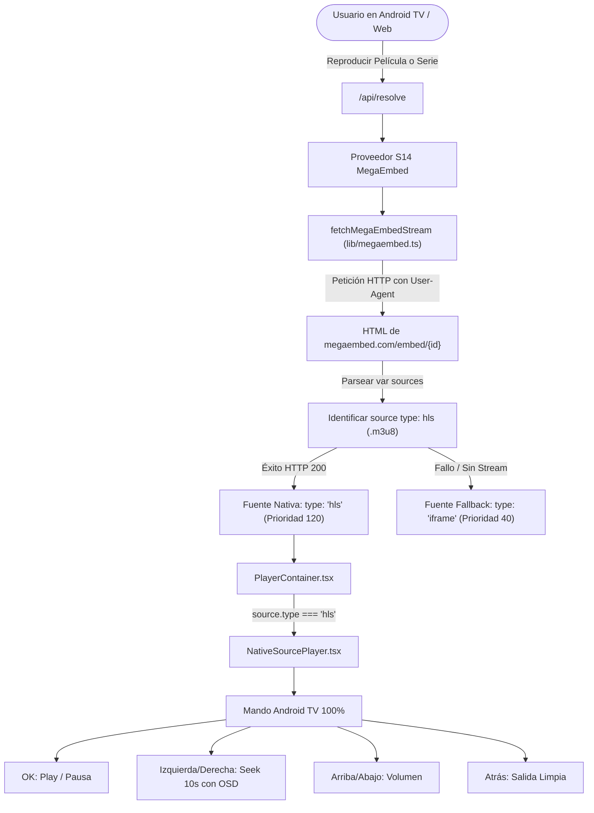

# Plan 062: Plan de Implementación del Extractor Nativo de MegaEmbed

## Arquitectura y Flujo de Trabajo

## Fases de Implementación

### Fase 1: Creación del Módulo Extractor (`lib/megaembed.ts`)
1. Implementar la extracción segura de `var sources = [...]` del HTML de MegaEmbed.
2. Extraer URLs HLS (`playercdn.xyz`, etc.).
3. Añadir timeout resiliente (máx. 4000ms) para no retrasar la resolución si el servidor estuviese lento.
4. Exportar `fetchMegaEmbedStream({ id, type, season, episode })`.

### Fase 2: Endpoint API (`app/api/megaembed/route.ts`)
1. Crear endpoint que reciba `id`, `type`, `s`, `e`.
2. Soportar modo JSON (`{ url, type: 'hls' }`) y modo redirección `redirect=1` (HTTP 307).

### Fase 3: Integración en `/api/resolve/route.ts`
1. Al iterar los proveedores elegibles, si es `megaembed` (o contiene plantilla de megaembed), llamar a `fetchMegaEmbedStream`.
2. Si devuelve un stream HLS, inyectar `megaembed-native` como fuente nativa (`type: 'hls'`) con alta prioridad (`120`).
3. Mantener `megaembed-iframe` como fuente secundaria de respaldo.

### Fase 4: Soporte HLS en `NativeSourcePlayer.tsx`
1. Instalar o integrar `hls.js` para navegadores de escritorio que no poseen decodificación HLS nativa en `<video>`.
2. En Android TV, utilizar la reproducción HLS nativa de Chromium/WebView.
3. Asegurar que los listeners de teclado y D-Pad gestionen el estado de reproducción, tiempos y buffering de forma uniforme.

### Fase 5: Listas Blancas en Android WebView y Capacitor
1. Añadir `playercdn.xyz`, `*.playercdn.xyz`, `megaembed.com`, `*.megaembed.com` a `AdBlockWebViewClient.java`.
2. Actualizar `capacitor.config.ts` en `allowNavigation`.

### Fase 6: Pruebas y Validación
1. Crear script de prueba `scripts/test-megaembed-extractor.mjs`.
2. Probar extracción en películas y series.
3. Probar que `/api/resolve` devuelve la fuente HLS lista.
4. Verificar compilación completa con `npm run build`.
